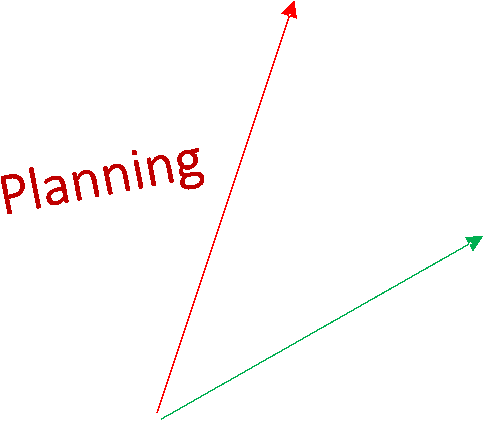
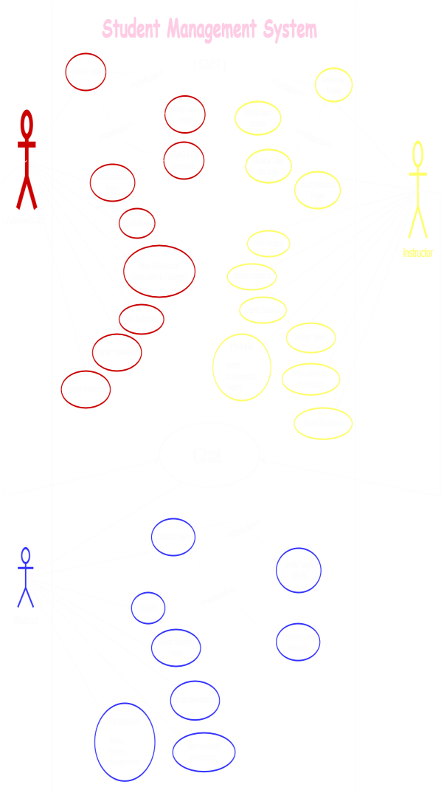

>  style="width:0.22135in;height:0.34288in" /> style="width:0.22135in;height:0.34288in" /> style="width:0.22222in;height:0.34375in" /> style="width:0.22222in;height:0.34375in" /> style="width:0.22135in;height:0.34288in" /> style="width:0.22743in;height:0.46962in" /> style="width:0.22743in;height:0.53299in" /> style="width:0.25608in;height:0.53125in" /> style="width:0.22135in;height:0.34288in" /> style="width:0.21615in;height:0.34288in" /> style="width:0.3776in;height:0.34462in" /> style="width:0.25608in;height:0.53125in" /> style="width:6.26458in;height:4.43264in" /> style="width:2.77778in;height:3.375in" /> style="width:0.36719in;height:0.34462in" /> style="width:0.59983in;height:0.34635in" /> style="width:0.98611in;height:0.46007in" /> style="width:0.8776in;height:0.45052in" /> style="width:0.77778in;height:0.5599in" /> style="width:0.40885in;height:0.4783in" /> style="width:0.40885in;height:0.4783in" /> style="width:7.26389in;height:10.85764in" />M. Dhanush NDICT (NVQ-05)
>
> VOCATION TRAINING AUTHORITY JK23ICT5D20005
>
> 1
>
>  style="width:7.26389in;height:10.85764in" />**Approval**
>
> ***Instructor***
>
> 2
>
>  style="width:7.26389in;height:10.85764in" />**Contents**

**1** Cover Page 1

**2** Approval 2

**3** Abstract 4

**4** Introduction 4

**5** System Analysis 5

**6** TimeLine 6

**7** Use Case Diagram of the System 8

**8** Tools Used to Build the Project 9

**9** Specification 10

**10** Conclusion 11

> 3
>
> **Abstract**

Our project aims to develop a comprehensive Student Management System
that streamlines administrative tasks related to student information,
academic records, and performance tracking. The system will enhance
efficiency, reduce manual effort, and provide a user-friendly interface
for both students and administrators.

> **Introduction**

In the current manual system, student-related activities are
time-consuming and costly. This proposed Student Management System will
address these challenges by automating processes and providing a
centralized platform for managing student data. The system will consist
of 3 main modules

> **1.Admin** **Module:** **2.Instructor** **Module:** **3.Student**
> **Module:**
>
> 4
>
> **System** **Analysis** • **Existing** **System**

Existing System The existing system relies on manual Attendance-marking,
which involves maintaining numerous student records and entering details
manually. This process is prone to errors and inefficiencies. Our
proposed system aims to overcome these limitations by introducing
automation and structured data management.

> • **Proposed** **System**
>
> *This* *Student* *Management* *System* *will* *offer* *the*
> *following* *features:*
>
> **1.** **User-Friendly** **Interface:**
>
> ***a.*** *Intuitive* *design* *for* *ease* *of* *use.* **2.**
> **Role-Based** **Access** **Control:**
>
> ***a.*** *Secure* *access* *for* *administrators* *and* *students.*
>
> 5
>
>  style="width:7.25in;height:10.84375in" /> style="width:7.25in;height:10.84375in" />**3.** **Admin** **Module:**
> *Login,*
>
> *Manage* *Profile,*
>
> *View* *daily* *attendance* *of* *(Instructors* *and* *Students),*
> *ADD,* *UPDATE,* *DELETE* *Instructors,*
>
> *Set* *Alerts* *for* *(Instructors* *and* *Students).*
>
> **4.** **Student** **Module:** *Register* *or* *Login,* *Manage*
> *Profile,*
>
> *View* *Students* *Attendance,* *Mark* *their* *daily* *attendance,*
>
> *Download* *Assignments,* *Test* *Papers,* *Notes,*
>
> *Read* *Alerts* *from* *Admin* *and* *Set* *Alerts* *to* *Students*
>
> **5.** **Instructors** **Module:** *Login,*
>
> *Manage* *Profile,*
>
> *View* *Students,* *Instructors* *Attendance,* *Mark* *their* *daily*
> *attendance,*
>
> *Share* *Assignments,* *Test* *Papers,* *Notes* *to* *Students,*
> *Read* *Alerts*
>
> 6
>
>  style="width:7.25in;height:10.84375in" /> style="width:1.82486in;height:0.56482in" /> style="width:2.11486in;height:0.56482in" /> style="width:2.11486in;height:0.56482in" /> style="width:2.16292in;height:1.52625in" /> style="width:1.40986in;height:0.56482in" /> style="width:2.04653in;height:0.56482in" /> style="width:1.79139in;height:0.56482in" /> style="width:1.53486in;height:0.56482in" /> style="width:2.07805in;height:0.56482in" /> style="width:1.84819in;height:0.56482in" /> style="width:2.16292in;height:1.45625in" /> style="width:1.89125in;height:1.53125in" /> style="width:2.11486in;height:0.56482in" /> style="width:1.68306in;height:0.56482in" /> style="width:2.11486in;height:0.56482in" /> style="width:1.86972in;height:0.56482in" /> style="width:1.72639in;height:0.56482in" /> style="width:2.03805in;height:0.56482in" /> style="width:2.16292in;height:1.45458in" /> style="width:1.88653in;height:0.56482in" /> style="width:2.06486in;height:0.56482in" /> style="width:1.43819in;height:0.56482in" /> style="width:1.75805in;height:0.56482in" /> style="width:2.16292in;height:1.69292in" /> style="width:1.62819in;height:0.56482in" /> style="width:1.81319in;height:0.56482in" /> style="width:1.82139in;height:0.56482in" /> style="width:1.81653in;height:0.56482in" /> style="width:0.93478in;height:0.56482in" /> style="width:1.89125in;height:1.46958in" /> style="width:1.88653in;height:1.24644in" />**TimeLine**
>
> Planning Duration – 4 Days Define project scope, objectives, and
> requirements
>
> 01
>
> Design Duration – 2 Weeks Design the system

architecture, including database structure, user interface and system
modules

> 04
>
> Analysis Duration – 1 Week Conduct a detailed analysis of the current
> system and identify areas for improvement
>
> 02 Development Duration – 2 Weeks Implement the system based on the
> design specifications.
>
> 05
>
> 7

Create Project Proposal Duration – 1 Day 03 Testing Duration

> 1 Weeks Conduct the
>
> system testing to identify and fix any bugs or issues
>
> 06 Deployment Duration
>
> 2 Days 07
>
>  style="width:6.27153in;height:7.27083in" /> style="width:7.25in;height:10.84375in" /> style="width:1.60834in;height:0.35167in" /> style="width:2.41406in;height:2.09681in" /> style="width:0.77691in;height:0.21181in" /> style="width:0.33247in;height:0.10417in" /> style="width:0.45226in;height:0.14931in" /> style="width:1.45142in;height:1.67437in" /> style="width:1.32334in;height:0.33834in" /> style="width:0.48264in;height:0.21875in" /> style="width:1.51335in;height:0.35167in" /> style="width:0.99132in;height:0.46007in" /> style="width:1.49167in;height:0.40833in" /> style="width:0.70399in;height:0.34722in" /> style="width:1.6933in;height:0.35167in" /> style="width:1.04253in;height:0.28906in" /> style="width:0.55035in;height:0.54948in" />**TimeLine**
>
> 8
>
>  style="width:7.25in;height:10.84375in" /> style="width:6.27153in;height:7.86458in" /> style="width:0.83681in;height:0.12413in" /> style="width:0.43403in;height:0.125in" /> style="width:0.52257in;height:0.12674in" /> style="width:0.48177in;height:0.10503in" /> style="width:0.19444in;height:0.13194in" />**Use** **Case**
> **Diagram**
>
> 9
>
>  style="width:7.25in;height:10.84375in" />**Tools** **Used** **to**
> **Build**

1\) Apache NetBeans

> • *To* *design* *the* *look* *and* *feel* • *Used* *to* *write*
> *Codes*

2\) Java

> • *To* *manage* *the* *Behavior* *of* *the* *System*

*3)* *MySQL*

> • *Used* *to* *store* *data* *in* *Database*

*4)* *XAMPP*

> • *Build* *a* *local* *Web* *Server* *in* *computer*

5\) Pichon

> • *Used* *to* *download* *Icons* *and* *Images*
>
> 10
>
>  style="width:7.25in;height:10.84375in" />**Specifications**

Processor

Ram

Operating System

JDK

*Apache* *NetBeans*

*-* *Intel* *PENTIUM* *or* *greater…*

*-* *Minimum* *2gb*

\- *Windows* *7,* *Windows* *8,* *Windows* *10,* *Windows* *11*

\- *JDK* *version* *8* *or* *greater..*

\- Apache NetBeans version 19 or greater (Optional)

> 11
>
>  style="width:7.25in;height:10.84375in" />**Conclusion**

The proposed **Student** **Management** **System** will revolutionize
student administration, enhance data accuracy, and improve overall
efficiency. By implementing this system, educational institutions can
focus more on student development and less on administrative overhead.

> 12
